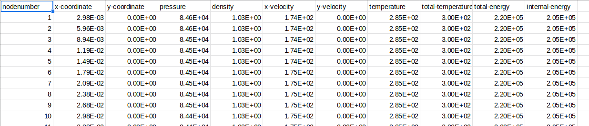
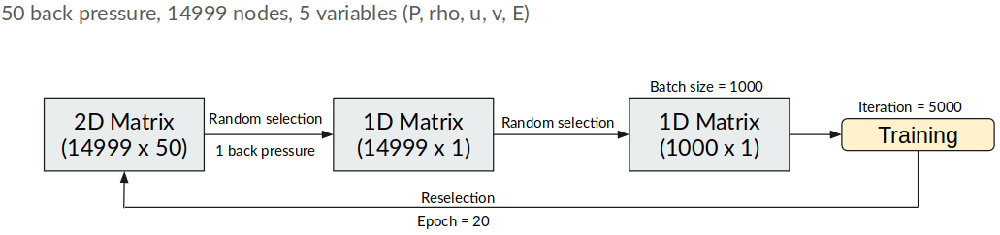

# **PINN**

## Objective
1. Make use of physics constraint with the aid of Neural Network to predict a flow field. Current version is just using fully connected neural network.

## Data preprocessing





There are a few parameters to play with:
1. Node filter - Filtering the number of nodes per dataset (1 represents no filter)
2. Numbers of layers - first element in array is the number of input, last element in array is the number of output, the in between represents number of layers and corresponding number of neurons. 
3. Number of epoch - the number of selection from the main pool of data
4. Number of iteration - the number of training iteration using the same batches
5. Batch size - the sizes of subsampling from [3]
6. Learning rate - the rate of learning for adam optimizer, typically at magnitude of 10^-3


## File positioning
1. /tmp - it holds all the checkpoints
2. /train - directory to contain the training datasets (.csv files)
3. /test - directory to contain the testing datasets (.csv files)
4. /data - directory to contain all datasets (.csv files) for backup purposes
5. /assets - directory to store images for github readme
6. /predict - directory to store the training loss data and predicted cases in csv format
7. /2d_inviscid_model - directory to store all models


## Dependencies
#### Tested on Ubuntu 18.04

- Tensorflow >= v1.13
- Python >= v3.0


## Basic Build Instructions

1. Clone this repo
2. To run and train the neural network
```
python3 main.py  
```
3. To read the predict.csv and make a comparison with true value. Put 1 for plotting or else 0.
```
python3 predict_csv.py {$MODEL_NAME_IN_2D_INVISCID_MODEL} {$PLOTORNOT}
```
